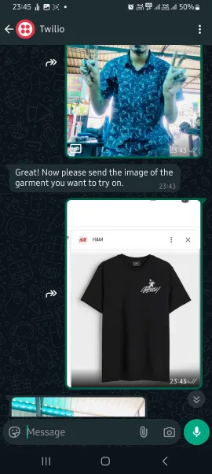
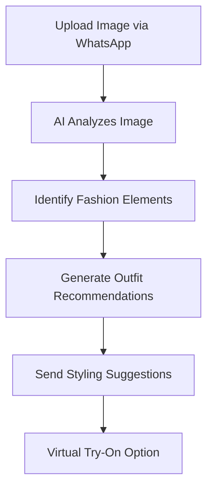
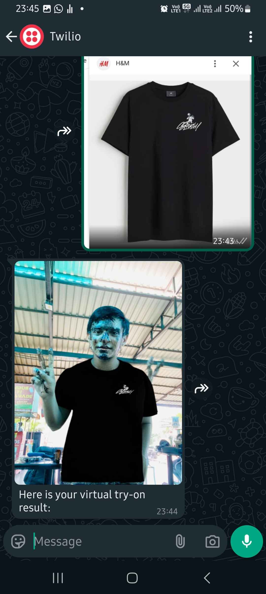

# 🎨 StyleSnap 👕👗

## 📱 *Discover the perfect outfit for every occasion* 📱

[](https://www.whatsapp.com)
[](https://www.anthropic.com)
[](https://www.stylesnap.com)


## 📋 Description

StyleSnap is an innovative fashion assistant powered by AI, designed to transform the way users interact with their wardrobe. By simply uploading a picture of themselves or a garment via WhatsApp, StyleSnap helps users discover personalized outfit recommendations. 

The app analyzes the image, takes the occasion, user's preferences, and current fashion trends into consideration, and suggests matching garments and accessories for a complete look. Whether it's casual wear, office attire, or an event outfit, StyleSnap ensures that users look and feel their best, effortlessly.

## 🔍 Problem Statement

In today's fast-paced world, many people struggle to find the perfect outfit that matches their style, body type, and occasion. With the overwhelming number of options available online and in stores, it can be time-consuming and frustrating to select outfits. 

Furthermore, users often need real-time fashion advice but lack access to personalized styling recommendations. There's a need for a convenient, accessible, and smart solution that simplifies the process of outfit selection.

## ✨ Benefits

| Benefit | Description |
|---------|-------------|
| 🚀 **Convenience** | Users can instantly receive outfit suggestions via WhatsApp, making the process simple and time-saving. |
| 👤 **Personalized Styling** | StyleSnap tailors outfit recommendations based on the user's preferences, body type, and occasion. |
| ⏱️ **Real-Time Advice** | The AI provides instant suggestions, ensuring that users never have to wait for style inspiration. |
| 🔄 **Versatile Recommendations** | The app suggests a range of garments, from casual to formal, helping users prepare for any event. |
| 📈 **Fashion Trends** | StyleSnap stays updated with the latest fashion trends, ensuring users always have access to trendy outfits. |
| ♻️ **Sustainability** | Encourages users to mix and match items they already own, promoting a more sustainable approach to fashion. |
| 💰 **Cost-Effective** | Users can find outfit inspirations without having to hire a personal stylist, and they can shop more mindfully. |



## 🚀 How It Works



## 💻 Tech Stack

- **Backend**: FastAPI, Python
- **AI Integration**: Gradio Client, Virtual Try-On API
- **Messaging**: Twilio WhatsApp API
- **Image Processing**: OpenCV, NumPy
- **Deployment**: Docker

## 🔮 Future Scope

| Feature | Description |
|---------|-------------|
| 👓 **Virtual Try-On** | Implement AR features that allow users to virtually try on clothes and see how the outfits look before purchasing. |
| 🛍️ **Enhanced Shopping** | Integrate with e-commerce platforms, allowing users to purchase recommended outfits directly from the app. |
| 🤝 **Brand Collaborations** | Partner with fashion retailers and designers to offer exclusive collections and discounts to users. |
| 📏 **Body Measurements** | Use AI to capture users' exact body measurements for even more accurate outfit suggestions. |
| 🌱 **Sustainability Features** | Add a "sustainable choices" option that recommends eco-friendly and ethically sourced garments. |
| 📅 **Outfit Planner** | Introduce a feature that lets users plan outfits for the week, integrating with their calendar to align with events. |
| 📱 **Social Integration** | Allow users to share their looks on social media platforms directly from StyleSnap, fostering a fashion-focused community. |
| 🧠 **AI Style Learning** | Utilize machine learning to adapt to each user's evolving style preferences, becoming more accurate and personalized over time. |

## 📸 Demo Screenshots

<div align="center">
  
   
  
</div>

---

StyleSnap is set to revolutionize the way users choose their outfits by combining convenience, personalization, and cutting-edge AI technology. With a user-friendly experience on a familiar platform like WhatsApp, StyleSnap makes fashion accessible, fun, and tailored to everyone's needs.

## 🛠️ Installation & Setup

1. Clone the repository:
   ```bash
   git clone https://github.com/Yash-Kavaiya/StyleSnap.git
   cd StyleSnap
   ```

2. Create a `.env` file with your credentials:
   ```
   TWILIO_ACCOUNT_SID=your_twilio_account_sid
   TWILIO_AUTH_TOKEN=your_twilio_auth_token
   IMAGE_URL=your_ngrok_url
   ```

3. Install dependencies:
   ```bash
   pip install -r requirements.txt
   ```

4. Run the application:
   ```bash
   uvicorn app:app --host 0.0.0.0 --port 8080
   ```

5. Alternatively, use Docker:
   ```bash
   docker build -t stylesnap .
   docker run -p 8080:8080 stylesnap
   ```

## 📄 License

[MIT](https://choosealicense.com/licenses/mit/)

---

<div align="center">
  <p>👗 <b>StyleSnap</b> - Making fashion accessible, personalized, and AI-powered! 👔</p>
</div>
