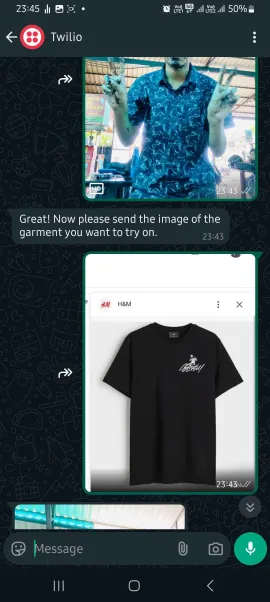
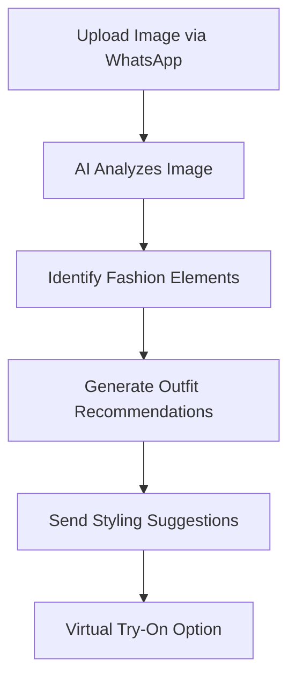
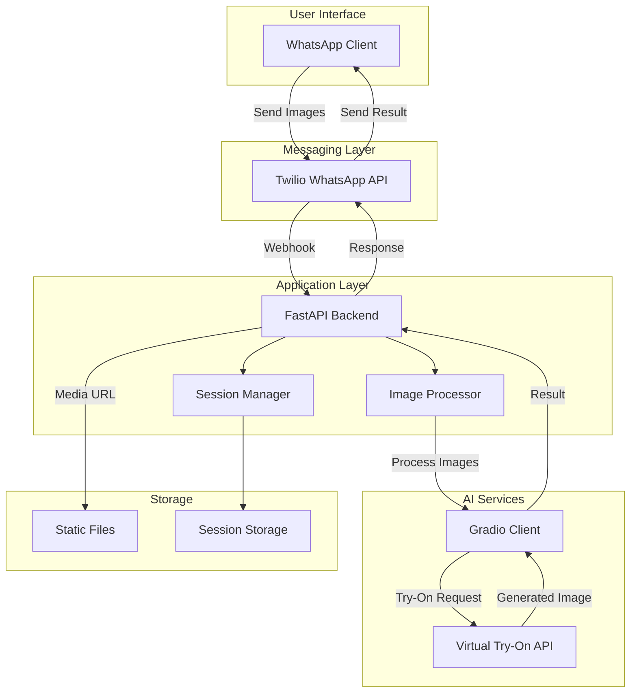
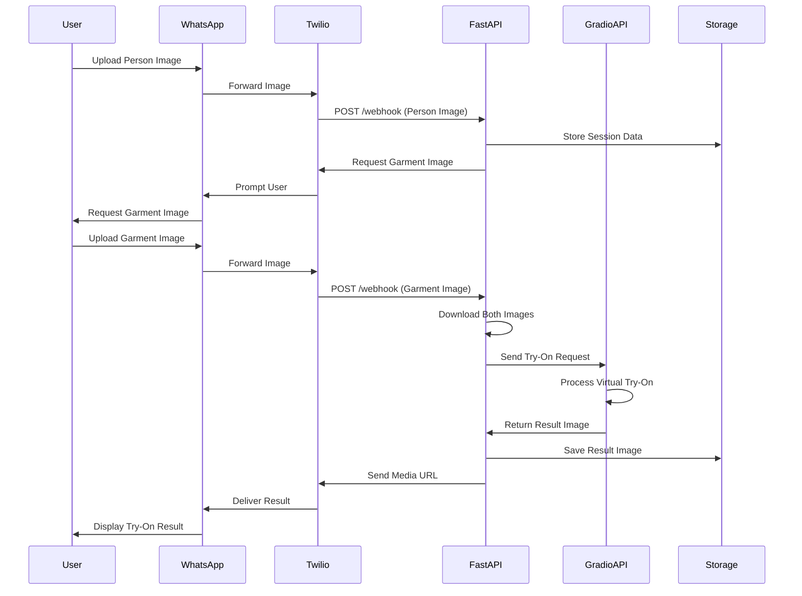
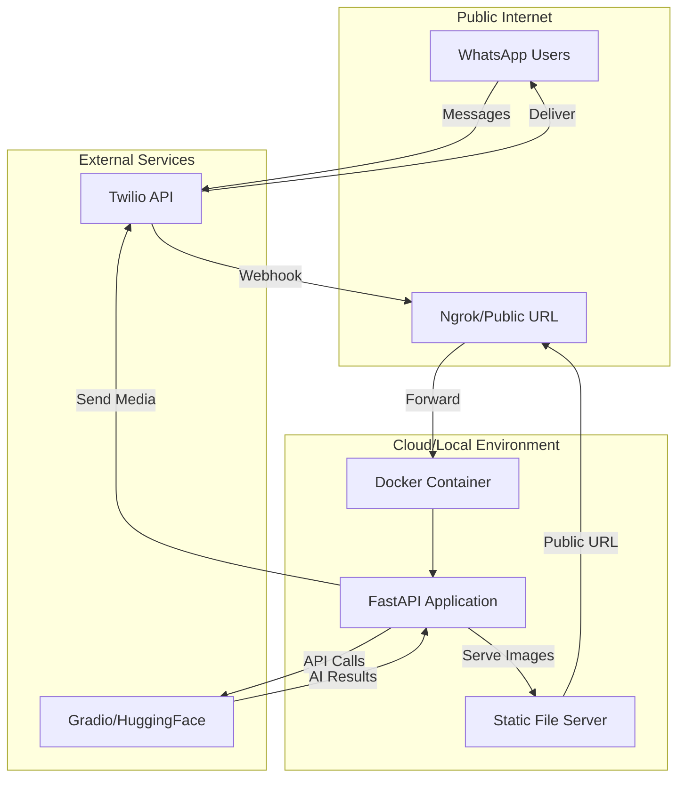
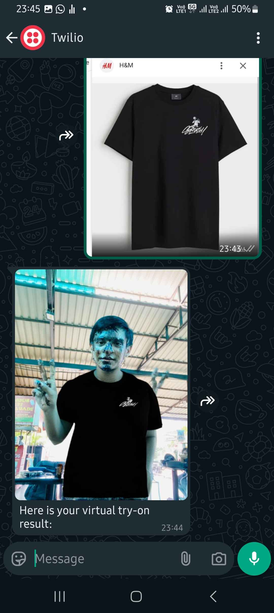
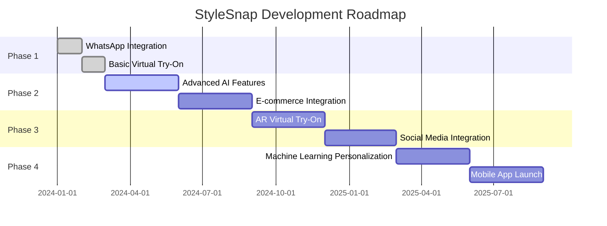

# 🎨 StyleSnap 👕👗

## 📱 *Discover the perfect outfit for every occasion* 📱

[](https://www.whatsapp.com)
[](https://www.anthropic.com)
[](https://www.stylesnap.com)


## 📺 Demo Video

[](https://www.youtube.com/shorts/LGll3aSwN0o)
*Click on the image above to watch the StyleSnap demo video on YouTube*

## 📋 Description

StyleSnap is an innovative fashion assistant powered by AI, designed to transform the way users interact with their wardrobe. By simply uploading a picture of themselves or a garment via WhatsApp, StyleSnap helps users discover personalized outfit recommendations. 

The app analyzes the image, takes the occasion, user's preferences, and current fashion trends into consideration, and suggests matching garments and accessories for a complete look. Whether it's casual wear, office attire, or an event outfit, StyleSnap ensures that users look and feel their best, effortlessly.

## 🔍 Problem Statement

In today's fast-paced world, many people struggle to find the perfect outfit that matches their style, body type, and occasion. With the overwhelming number of options available online and in stores, it can be time-consuming and frustrating to select outfits. 

Furthermore, users often need real-time fashion advice but lack access to personalized styling recommendations. There's a need for a convenient, accessible, and smart solution that simplifies the process of outfit selection.

## ✨ Benefits

| Benefit | Description |
|---------|-------------|
| 🚀 **Convenience** | Users can instantly receive outfit suggestions via WhatsApp, making the process simple and time-saving. |
| 👤 **Personalized Styling** | StyleSnap tailors outfit recommendations based on the user's preferences, body type, and occasion. |
| ⏱️ **Real-Time Advice** | The AI provides instant suggestions, ensuring that users never have to wait for style inspiration. |
| 🔄 **Versatile Recommendations** | The app suggests a range of garments, from casual to formal, helping users prepare for any event. |
| 📈 **Fashion Trends** | StyleSnap stays updated with the latest fashion trends, ensuring users always have access to trendy outfits. |
| ♻️ **Sustainability** | Encourages users to mix and match items they already own, promoting a more sustainable approach to fashion. |
| 💰 **Cost-Effective** | Users can find outfit inspirations without having to hire a personal stylist, and they can shop more mindfully. |



## 🚀 How It Works


```mermaid
graph TD
    A[Upload Image via WhatsApp] --> B[AI Analyzes Image]
    B --> C[Identify Fashion Elements]
    C --> D[Generate Outfit Recommendations]
    D --> E[Send Styling Suggestions]
    E --> F[Virtual Try-On Option]
```

## 🏗️ System Architecture


```mermaid
graph TB
    subgraph "User Interface"
        A[WhatsApp Client]
    end
    
    subgraph "Messaging Layer"
        B[Twilio WhatsApp API]
    end
    
    subgraph "Application Layer"
        C[FastAPI Backend]
        D[Session Manager]
        E[Image Processor]
    end
    
    subgraph "AI Services"
        F[Gradio Client]
        G[Virtual Try-On API]
    end
    
    subgraph "Storage"
        H[Static Files]
        I[Session Storage]
    end
    
    A -->|Send Images| B
    B -->|Webhook| C
    C --> D
    D --> I
    C --> E
    E -->|Process Images| F
    F -->|Try-On Request| G
    G -->|Generated Image| F
    F -->|Result| C
    C -->|Media URL| H
    C -->|Response| B
    B -->|Send Result| A
```

## 🔄 Process Flow Sequence


```mermaid
sequenceDiagram
    participant User
    participant WhatsApp
    participant Twilio
    participant FastAPI
    participant GradioAPI
    participant Storage
    
    User->>WhatsApp: Upload Person Image
    WhatsApp->>Twilio: Forward Image
    Twilio->>FastAPI: POST /webhook (Person Image)
    FastAPI->>Storage: Store Session Data
    FastAPI->>Twilio: Request Garment Image
    Twilio->>WhatsApp: Prompt User
    WhatsApp->>User: Request Garment Image
    
    User->>WhatsApp: Upload Garment Image
    WhatsApp->>Twilio: Forward Image
    Twilio->>FastAPI: POST /webhook (Garment Image)
    FastAPI->>FastAPI: Download Both Images
    FastAPI->>GradioAPI: Send Try-On Request
    GradioAPI->>GradioAPI: Process Virtual Try-On
    GradioAPI->>FastAPI: Return Result Image
    FastAPI->>Storage: Save Result Image
    FastAPI->>Twilio: Send Media URL
    Twilio->>WhatsApp: Deliver Result
    WhatsApp->>User: Display Try-On Result
```

## 💻 Tech Stack

| Category | Technologies | Purpose |
|----------|-------------|---------|
| **Backend Framework** | FastAPI, Python 3.9+ | High-performance web framework for building APIs |
| **AI/ML Services** | Gradio Client, Nymbo Virtual Try-On API | AI-powered virtual try-on functionality |
| **Messaging Platform** | Twilio WhatsApp API | WhatsApp integration for user communication |
| **Image Processing** | OpenCV, NumPy, Pillow | Image manipulation and processing |
| **Web Server** | Uvicorn | ASGI server for FastAPI application |
| **Environment Management** | python-dotenv | Manage environment variables securely |
| **Containerization** | Docker | Application containerization and deployment |
| **HTTP Client** | Requests | Making HTTP requests to external APIs |

## 🔮 Future Scope

| Feature | Description |
|---------|-------------|
| 👓 **Virtual Try-On** | Implement AR features that allow users to virtually try on clothes and see how the outfits look before purchasing. |
| 🛍️ **Enhanced Shopping** | Integrate with e-commerce platforms, allowing users to purchase recommended outfits directly from the app. |
| 🤝 **Brand Collaborations** | Partner with fashion retailers and designers to offer exclusive collections and discounts to users. |
| 📏 **Body Measurements** | Use AI to capture users' exact body measurements for even more accurate outfit suggestions. |
| 🌱 **Sustainability Features** | Add a "sustainable choices" option that recommends eco-friendly and ethically sourced garments. |
| 📅 **Outfit Planner** | Introduce a feature that lets users plan outfits for the week, integrating with their calendar to align with events. |
| 📱 **Social Integration** | Allow users to share their looks on social media platforms directly from StyleSnap, fostering a fashion-focused community. |
| 🧠 **AI Style Learning** | Utilize machine learning to adapt to each user's evolving style preferences, becoming more accurate and personalized over time. |

## 🚢 Deployment Architecture


```mermaid
graph TB
    subgraph "Public Internet"
        A[WhatsApp Users]
        B[Ngrok/Public URL]
    end
    
    subgraph "Cloud/Local Environment"
        C[Docker Container]
        D[FastAPI Application]
        E[Static File Server]
    end
    
    subgraph "External Services"
        F[Twilio API]
        G[Gradio/HuggingFace]
    end
    
    A -->|Messages| F
    F -->|Webhook| B
    B -->|Forward| C
    C --> D
    D -->|Serve Images| E
    E -->|Public URL| B
    D -->|API Calls| G
    G -->|AI Results| D
    D -->|Send Media| F
    F -->|Deliver| A
```

## 🔐 Security Considerations

| Aspect | Implementation | Best Practice |
|--------|---------------|---------------|
| **API Keys** | Stored in `.env` file | Never commit `.env` to repository |
| **Authentication** | Twilio webhook validation | Verify webhook signatures |
| **Image Storage** | Temporary local storage | Clean up after processing |
| **Session Management** | In-memory storage | Consider Redis for production |
| **HTTPS** | Required for webhooks | Use SSL/TLS certificates |

## 🧪 Testing

| Test Type | Command | Description |
|-----------|---------|-------------|
| Manual Testing | Use Twilio Console | Test webhook with sample data |
| Local Testing | `ngrok http 8080` | Expose local server for testing |
| API Testing | `curl -X GET http://localhost:8080/` | Test health endpoint |

## 📸 Demo Screenshots

<div align="center">
  
   
  
</div>

---

StyleSnap is set to revolutionize the way users choose their outfits by combining convenience, personalization, and cutting-edge AI technology. With a user-friendly experience on a familiar platform like WhatsApp, StyleSnap makes fashion accessible, fun, and tailored to everyone's needs.

## 🛠️ Installation & Setup

### Prerequisites

| Requirement | Version | Purpose |
|------------|---------|---------|
| Python | 3.9+ | Core runtime environment |
| pip | Latest | Package manager |
| Docker | Latest (Optional) | Containerization |
| Twilio Account | Active | WhatsApp messaging |
| Ngrok | Latest | Local webhook testing |

### Environment Variables

| Variable | Description | Example |
|----------|-------------|---------|
| `TWILIO_ACCOUNT_SID` | Your Twilio Account SID | `ACxxxxxxxxxxxxxxxxxxxxxxxxxxxxxxxx` |
| `TWILIO_AUTH_TOKEN` | Your Twilio Auth Token | `your_auth_token_here` |
| `IMAGE_URL` | Public URL for serving images | `https://your-domain.ngrok.io` |

### Setup Instructions

1. **Clone the repository:**
   ```bash
   git clone https://github.com/Yash-Kavaiya/StyleSnap.git
   cd StyleSnap
   ```

2. **Create a `.env` file with your credentials:**
   ```bash
   TWILIO_ACCOUNT_SID=your_twilio_account_sid
   TWILIO_AUTH_TOKEN=your_twilio_auth_token
   IMAGE_URL=your_ngrok_url
   ```

3. **Install dependencies:**
   ```bash
   pip install -r requirements.txt
   ```

4. **Run the application:**
   ```bash
   uvicorn app:app --host 0.0.0.0 --port 8080
   ```

5. **Alternatively, use Docker:**
   ```bash
   docker build -t stylesnap .
   docker run -p 8080:8080 stylesnap
   ```

## 📁 Project Structure

```
StyleSnap/
│
├── app.py                  # Main FastAPI application
├── requirements.txt        # Python dependencies
├── Dockerfile             # Docker configuration
├── .env                   # Environment variables (not in repo)
├── .gitignore            # Git ignore rules
│
├── static/               # Static files directory
│   └── result.png        # Generated try-on results
│
├── Images/               # Demo and documentation images
│   ├── 1.webp           # StyleSnap interface
│   ├── 2.webp           # Outfit recommendation
│   └── 3.jpg            # Virtual try-on demo
│
├── person_image.jpg      # Temporary person image
└── garment_image.jpg     # Temporary garment image
```

## 🔌 API Endpoints

| Endpoint | Method | Description | Parameters |
|----------|--------|-------------|------------|
| `/` | GET | Health check and API info | None |
| `/webhook` | POST | Twilio WhatsApp webhook | Form data with media |

## 🤝 Contributing

We welcome contributions! Here's how you can help:

| Contribution Type | How to Contribute |
|------------------|-------------------|
| 🐛 **Bug Reports** | Open an issue with details about the bug |
| ✨ **Feature Requests** | Submit an issue describing the feature |
| 📝 **Documentation** | Improve README or add code comments |
| 💻 **Code Contributions** | Fork, create a branch, and submit a PR |
| 🧪 **Testing** | Test the app and report issues |

### Development Workflow


```mermaid
graph LR
    A[Fork Repository] --> B[Create Feature Branch]
    B --> C[Make Changes]
    C --> D[Test Locally]
    D --> E[Commit Changes]
    E --> F[Push to Fork]
    F --> G[Create Pull Request]
    G --> H[Code Review]
    H --> I[Merge]
```

## 🐛 Troubleshooting

| Issue | Possible Cause | Solution |
|-------|---------------|----------|
| Webhook not receiving messages | Ngrok not running or incorrect URL | Restart ngrok and update `IMAGE_URL` in `.env` |
| Image download fails | Invalid Twilio credentials | Verify `TWILIO_ACCOUNT_SID` and `TWILIO_AUTH_TOKEN` |
| Virtual try-on not working | Gradio API unavailable | Check Gradio API status and network connection |
| Docker build fails | Missing dependencies | Ensure all dependencies are in `requirements.txt` |
| Port already in use | Port 8080 occupied | Use different port: `--port 8081` |

## 📊 Performance Metrics

| Metric | Target | Description |
|--------|--------|-------------|
| **Response Time** | < 10s | Time from image upload to result delivery |
| **API Uptime** | 99.9% | Service availability |
| **Image Processing** | < 5s | Time to process virtual try-on |
| **Concurrent Users** | 100+ | Maximum simultaneous users supported |

## 🎯 Roadmap


```mermaid
gantt
    title StyleSnap Development Roadmap
    dateFormat  YYYY-MM
    section Phase 1
    WhatsApp Integration       :done, 2024-01, 2024-02
    Basic Virtual Try-On       :done, 2024-02, 2024-03
    section Phase 2
    Advanced AI Features       :active, 2024-03, 2024-06
    E-commerce Integration     :2024-06, 2024-09
    section Phase 3
    AR Virtual Try-On         :2024-09, 2024-12
    Social Media Integration  :2024-12, 2025-03
    section Phase 4
    Machine Learning Personalization :2025-03, 2025-06
    Mobile App Launch         :2025-06, 2025-09
```

## 📞 Support & Contact

| Channel | Link | Purpose |
|---------|------|---------|
| 🐛 **Issues** | [GitHub Issues](https://github.com/Yash-Kavaiya/StyleSnap/issues) | Bug reports and feature requests |
| 💬 **Discussions** | [GitHub Discussions](https://github.com/Yash-Kavaiya/StyleSnap/discussions) | Community support and Q&A |
| 📧 **Email** | [Contact](mailto:support@stylesnap.com) | Direct support |

## 📄 License

[MIT](https://choosealicense.com/licenses/mit/)

## 🙏 Acknowledgments

| Project | Description |
|---------|-------------|
| [Twilio](https://www.twilio.com/) | WhatsApp messaging infrastructure |
| [Gradio](https://gradio.app/) | AI model interface |
| [FastAPI](https://fastapi.tiangolo.com/) | Modern web framework |
| [Nymbo Virtual Try-On](https://huggingface.co/spaces/Nymbo/Virtual-Try-On) | AI-powered virtual try-on technology |

---

<div align="center">
  <p>👗 <b>StyleSnap</b> - Making fashion accessible, personalized, and AI-powered! 👔</p>
  <p>⭐ Star us on GitHub if you find this project useful!</p>
  
  [](https://github.com/Yash-Kavaiya/StyleSnap/stargazers)
  [](https://github.com/Yash-Kavaiya/StyleSnap/network/members)
  [](https://github.com/Yash-Kavaiya/StyleSnap/watchers)
</div>
